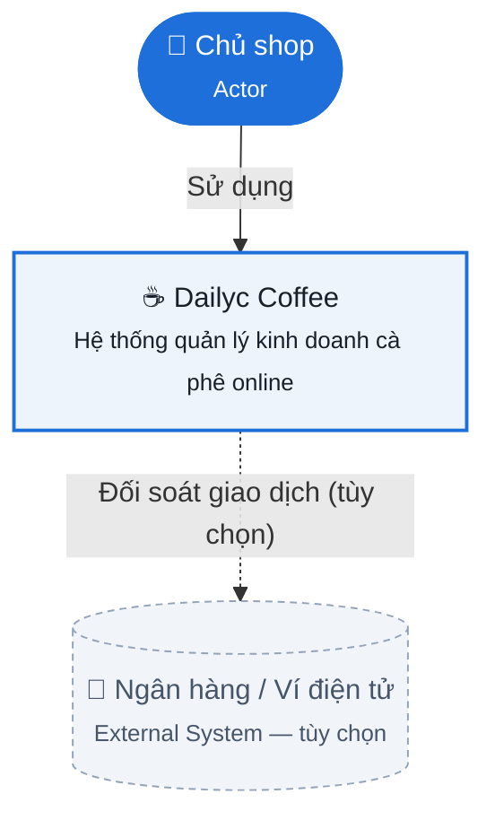
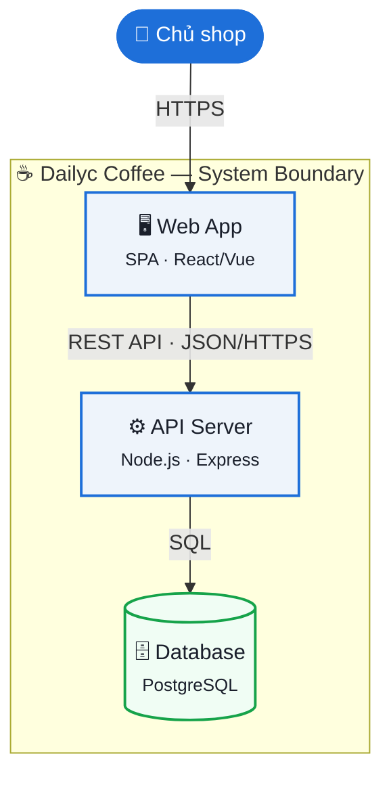
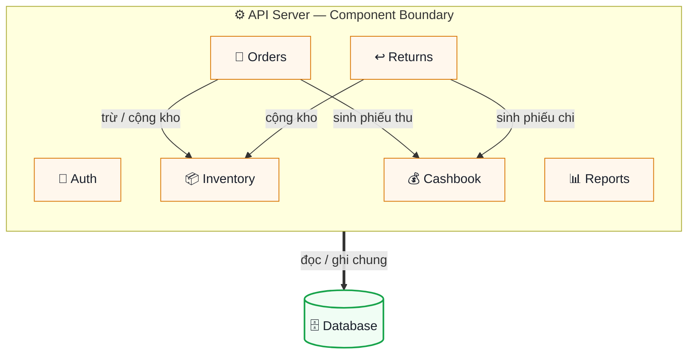
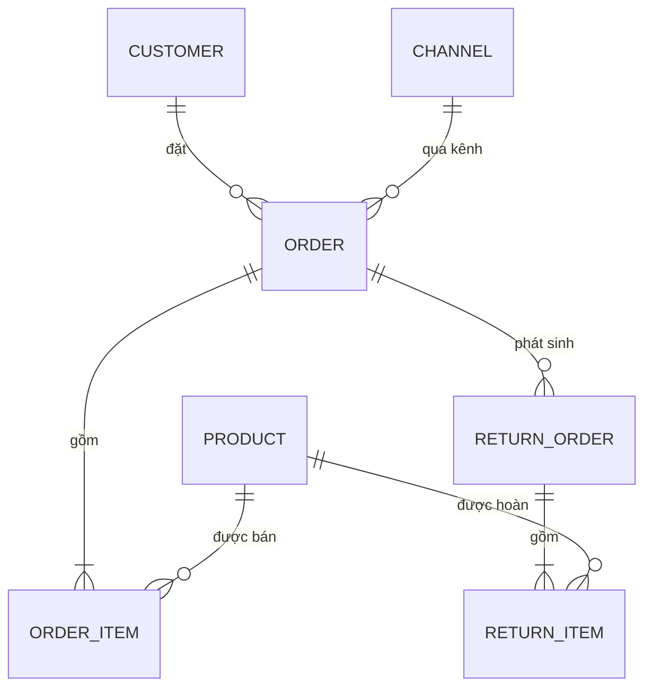
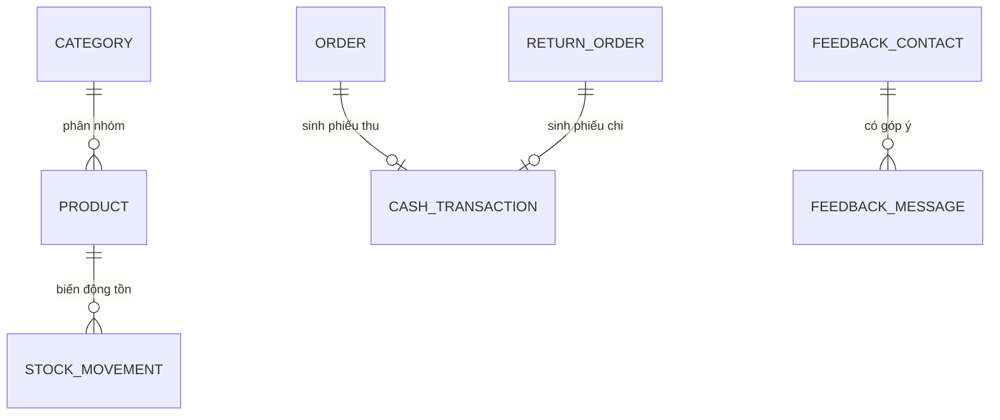
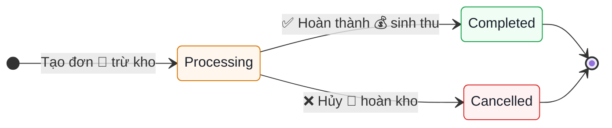
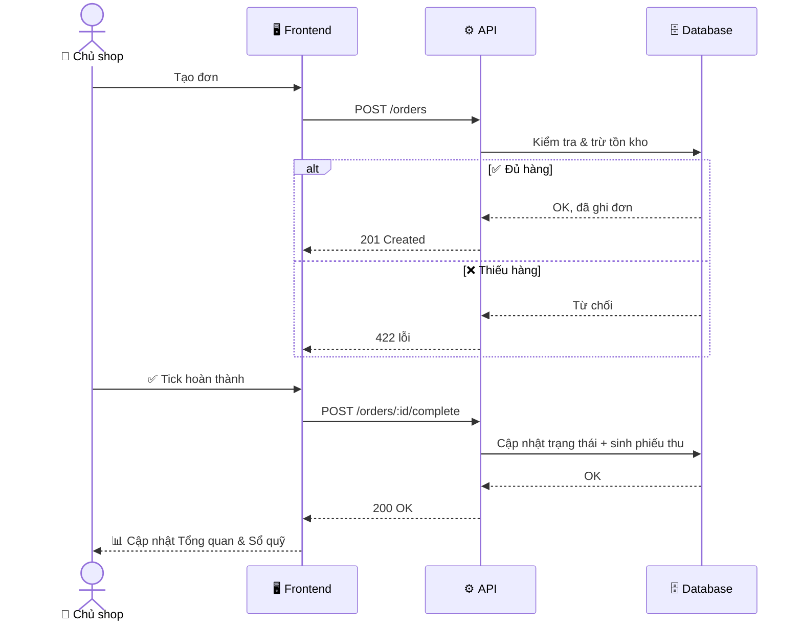
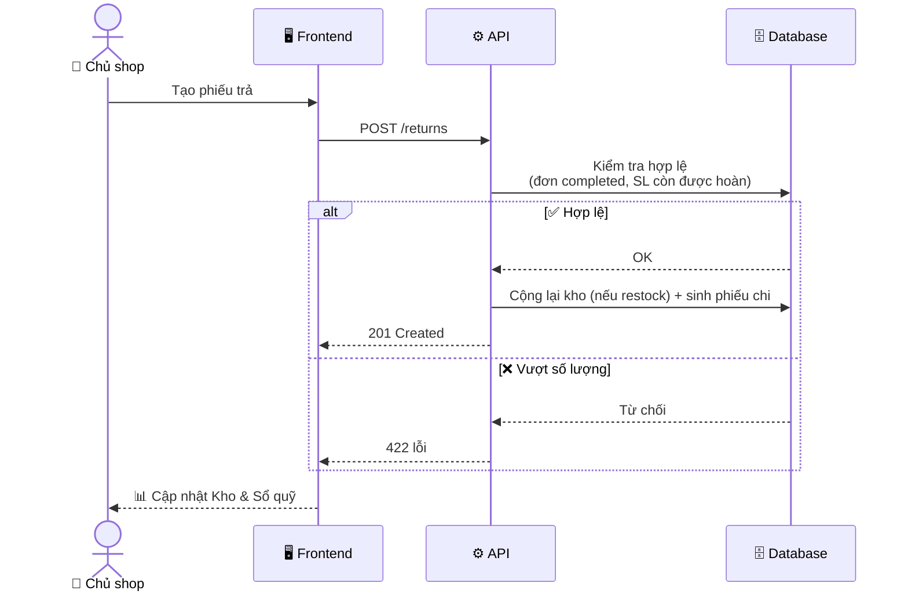

# ☕ Kiến trúc hệ thống Dailyc Coffee

> Tài liệu này dùng 3 chuẩn quốc tế phổ biến trong ngành phần mềm:
> **C4 Model** (kiến trúc hệ thống, 3 tầng zoom Context → Container → Component) ·
> **Crow's Foot Notation** (sơ đồ dữ liệu ERD) ·
> **UML State & Sequence Diagram** (vòng đời trạng thái & luồng xử lý).

---

## PHẦN A — KIẾN TRÚC HỆ THỐNG (C4 Model)

### A1. Level 1 — System Context
*Hệ thống nhìn từ bên ngoài: ai dùng, kết nối với gì.*

### A2. Level 2 — Container Diagram
*Bên trong hệ thống gồm những khối chạy độc lập nào (app, server, database).*

### A3. Level 3 — Component Diagram
*Phóng to bên trong API Server: các module nghiệp vụ và quan hệ giữa chúng.*

> Ghi chú: `Reports` và `Auth` chỉ đọc/ghi trực tiếp Database, không có quan hệ chéo với module khác — nên không vẽ thêm đường để giữ sơ đồ sạch.

---

## PHẦN B — SƠ ĐỒ DỮ LIỆU (ERD — Crow's Foot Notation)

### B1. Miền dữ liệu: Luồng bán hàng

### B2. Miền dữ liệu: Hạ tầng hỗ trợ

### B3. Từ điển dữ liệu (Data Dictionary)

| Bảng | Khóa / Trường quan trọng | Ghi chú |
|---|---|---|
| **Product** | `code` (UK), `sellPrice`, `costPrice`, `stockQty`, `minStockThreshold`, `status` | Không xóa được nếu đã có giao dịch |
| **Order** | `code` (UK), `status` (processing/completed/cancelled), `paymentMethod`, `createdAt`, `completedAt` | Completed thì khóa, không sửa |
| **OrderItem** | `quantity`, `unitPrice`, `unitCost` | Chụp giá tại thời điểm bán, không tham chiếu giá hiện tại |
| **ReturnOrder** | `reason`, `refundAmount`, `refundMethod` | Chỉ tạo được từ Order đã completed |
| **ReturnItem** | `quantity`, `restock` (boolean) | `restock=false` khi hàng hỏng |
| **StockMovement** | `type` (sale/return/manual_adjust/cancel_restore), `quantityChange` | Nhật ký toàn bộ biến động tồn |
| **CashTransaction** | `type` (thu/chi), `fundType` (cash/bank/ewallet), `amount` | Sinh tự động từ Order/ReturnOrder hoặc tạo tay |
| **User** | `email` (UK), `passwordHash`, `role` (owner/staff) | Mật khẩu hash bcrypt |

---

## PHẦN C — HÀNH VI HỆ THỐNG (UML)

### C1. Vòng đời Đơn đi (State Diagram)

### C2. Luồng xử lý — Tạo đơn → Hoàn thành (Sequence Diagram)

### C3. Luồng xử lý — Trả hàng (Sequence Diagram)

---

## PHẦN D — MAPPING CODEBASE

| Feature (Frontend) | Module (Backend) | Bảng dữ liệu chính |
|---|---|---|
| 🛒 orders | /modules/orders | orders, order_items, stock_movements |
| 📦 inventory | /modules/products | products, stock_movements |
| ↩️ returns | /modules/returns | return_orders, return_items |
| 💰 cashbook | /modules/cashbook | cash_transactions |
| 💬 customers-feedback | /modules/customers | feedback_contacts, feedback_messages |
| 📊 reports | /modules/reports | đọc tổng hợp từ các bảng trên |
| 🔐 (toàn hệ thống) | /modules/auth | users |
